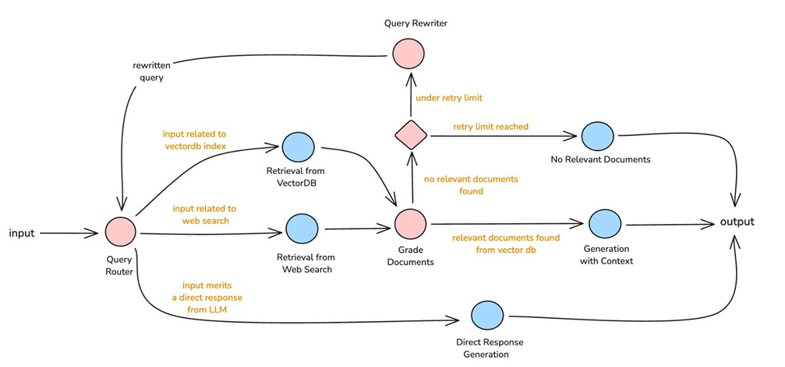

# TechMart Adaptive RAG System

🌐 **[Live Demo](https://frontend-doz9832hz-eds-projects-63c4b9cb.vercel.app)**

An intelligent Q&A system built on the TechMart knowledge base, featuring an implementation of Adaptive Retrieval‑Augmented Generation (RAG). It leverages Anthropic models, subagents, tools, and skills through the Anthropic Agent SDK

## Features

- **Intelligent Query Routing**: Automatically determines whether to use vector database search, web search, or direct LLM response
- **Document Relevance Grading**: Evaluates and ranks retrieved documents to ensure high-quality context
- **Adaptive Query Rewriting**: Reformulates queries when initial retrieval yields poor results
- **Citation-Backed Answers**: Generates responses with source citations for transparency and verification
- **Retry Logic**: Implements smart retry mechanisms with fallback to web search when vector DB results are insufficient

## System Workflow



1. **Query Reception**: User submits a question via UI (Next.js/Gradio)
2. **Query Routing**: Query Agent determines the best retrieval strategy (vectordb/web_search/direct_llm)
3. **Document Retrieval**: Retrieval Agent fetches relevant documents from ChromaDB or web search
4. **Relevance Grading**: Grader Agent evaluates and ranks documents for quality
5. **Adaptive Retry**: If documents are irrelevant, query is rewritten and retrieval retries
6. **Answer Generation**: Generator Agent synthesizes final answer with citations
7. **Response Delivery**: Formatted answer returned with metadata (sources, retries, strategy used)

## Technical Features

### ✅1. Multi-Agent System

Four specialized Claude Agent SDK agents working in concert:

- **Query Agent**: Routes queries to appropriate data sources and rewrites queries for improved retrieval
  - Skills: `routing_skill`, `rewriting_skill`

- **Retrieval Agent**: Fetches relevant documents from ChromaDB vector database and delegates to web search when needed
  - Tools: `chromadb_retriever`
  - Subagent: Web Search Agent for fallback retrieval

- **Grader Agent**: Evaluates document relevance and ranks results to ensure quality context
  - Skills: `grading_skill`, `ranking_skill`

- **Generator Agent**: Synthesizes final answers with proper citations
  - Skills: `generation_skill`, `citation_skill`

### ✅2. Python Orchestration Function

The `run_adaptive_rag()` function in `orchestrator.py` manages the workflow:
- NOT an Agent SDK agent - plain async Python function. This helps keep Anthropic API usage costs in check and improves response latency
- Coordinates agent interactions: routing → retrieval → grading → generation
- Implements retry loop logic with state management
- Handles fallback strategies when document quality is insufficient

### ✅3. Skills, Tools & Subagents

**6 Custom Skills** for specialized LLM capabilities:
- Query routing and rewriting
- Document grading and ranking
- Answer generation with citations

**Custom Tool** for external integrations:
- ChromaDB vector database retrieval

**Sub Agents** for web searches:
- Use Exa AI Search API

### ✅4. Adaptive Workflow

Dynamic retrieval strategy that:
- Evaluates document relevance after retrieval
- Triggers query rewriting when documents are irrelevant
- Falls back to web search after max retries
- Ensures high-quality answers through iterative refinement

## Architecture Diagram

```
Gradio UI (main.py)
       ↓
┌─────────────────────────────────────────────────────────────────┐
│          PYTHON ORCHESTRATION FUNCTION                          │
│          (run_adaptive_rag in orchestrator.py)                  │
│                                                                 │
│  - NOT an Agent SDK agent                                       │
│  - Plain async Python function                                  │
│  - Manages workflow: routing → retrieval → grading → retry      │
│  - Handles state: num_retries, current_query, original_query    │
│  - Implements retry loop logic                                  │
└───────────┬─────────────────────────────────────────────────────┘
            │
            ↓ Delegates to Query Agent first
            │
    ┌───────┴─────────────────────────────────────────────────────┐
    │       ┌──────────────┐                                      │
    │       │ QUERY AGENT  │  Returns: vectordb/web_search/       │
    │       │              │           direct_llm                 │
    │       │ Skills:      │                                      │
    │       │ • routing_   │  (RETRY LOOP: When Grader Agent      │
    │    ┌─►│   skill      │   finds no relevant docs & retry     │
    │    │  │ • rewriting_ │   < limit, Orchestrator calls Query  │
    │    │  │   skill      │   Agent in Rewriting Mode to enhance │
    │    │  │              │   query, then loops back to routing) │
    │    │  │ Handles:     │                                      │
    │    │  │ • Routing    │                                      │
    │    │  │ • Rewriting  │                                      │
    │    │  └──────┬───────┘                                      │
    │    │         │                                              │
    │    │         ↓                                              │
    │    │  IF direct_llm ────────────────────────────┐          │
    │    │         │                                  │          │
    │    │  IF vectordb/web_search                    │          │
    └────┼─────────┼──────────────────────────────────┼──────────┘
         │         │                                  │
         │         ↓                                  ↓
         │  ┌───────────────┐                 ┌──────────────┐
         │  │ RETRIEVAL     │                 │ GENERATOR    │
         │  │ AGENT         │                 │ AGENT        │
         │  │               │                 │              │
         │  │ Tools:        │                 │ Skills:      │
         │  │ • chromadb_   │                 │ • generation │
         │  │   retriever   │                 │   _skill     │
         │  │               │                 │ • citation_  │
         │  │ Subagents:    │                 │   skill      │
         │  │ • web_search_ │                 │              │
         │  │   agent       │                 │              │
         │  │               │                 │              │
         │  │ Handles:      │                 │ Handles:     │
         │  │ • Vector DB   │                 │ • Synthesis  │
         │  │ • Web search  │                 │   (with or   │
         │  │               │                 │    without   │
         │  │               │                 │    context)  │
         │  │               │                 │ • Citations  │
         │  │               │                 │ • Quality    │
         │  │               │                 └──────────────┘
         │  └───────┬───────┘                        ▲
         │          │                                │
         │          ↓                                │
         │  ┌────────────────┐                       │
         │  │ GRADER AGENT   │                       │
         │  │                │                       │
         │  │ Skills:        │                       │
         │  │ • grading_     │                       │
         │  │   skill        │                       │
         │  │ • ranking_     │                       │
         │  │   skill        │                       │
         │  │                │                       │
         │  │ Handles:       │                       │
         │  │ • Relevance    │                       │
         │  │   evaluation   │                       │
         │  │ • Scoring      │                       │
         │  └────────┬───────┘                       │
         │           │                               │
         │           ├─ If relevant docs ────────────┘
         │           │
         │           └─ If no relevant + retry < limit
         │
         └──────────── (Orchestrator loops back to Query Agent
                        in Rewriting Mode)

┌─────────────────────────────────────────────────────────────────┐
│                  ChromaDB Vector Store                          │
│              (Jina Embeddings v3 / Persistent)                  │
│                      chroma_db/ directory                       │
│                                                                 │
│  ┌─────────────────┐  ┌─────────────┐  ┌──────────────────┐     │
│  │   catalog       │  │     faq     │  │ troubleshooting  │     │
│  │                 │  │             │  │                  │     │
│  │ Product info    │  │ Customer    │  │ Technical        │     │
│  │ SKU, specs,     │  │ Q&A pairs   │  │ support guides   │     │
│  │ pricing         │  │ policies    │  │ solutions        │     │
│  └─────────────────┘  └─────────────┘  └──────────────────┘     │
└─────────────────────────────────────────────────────────────────┘
                         ▲
                         │
┌────────────────────────┴────────────────────────────────────────┐
│                    Data Preparation Layer                       │
│          (Pre-indexing: CSV → Pipe-separated → Vectors)         │
│                   (setup_vectordb.py script)                    │
│                                                                 │
│  data/techmart_catalog.csv                                      │
│  data/techmart_faq.csv                                          │
│  data/techmart_troubleshooting.csv                              │
└─────────────────────────────────────────────────────────────────┘
```

## Knowledge Base

The TechMart knowledge base contains:
1. **techmart_catalog.csv** — Product inventory with specifications, pricing, availability
2. **techmart_faq.csv** — Common customer questions and answers
3. **techmart_troubleshooting.csv** — Technical problem-solution pairs
- Stored in ChromaDB vector database for semantic search
- Accessible via `setup_vectordb.py` for initialization

## Project Structure

```
adaptive_rag_v2/
├── agents/                      # Agent SDK agent implementations
│   ├── __init__.py             # Agent registry (AGENT_CLASSES dict)
│   ├── query_agent.py          # Query routing & rewriting
│   ├── retrieval_agent.py      # ChromaDB & web search retrieval
│   ├── grader_agent.py         # Document relevance grading
│   ├── generator_agent.py      # Answer generation with citations
│   └── web_search_agent.py     # Web search subagent
│
├── prompts/                     # System prompts as markdown files
│   ├── __init__.py             # load_prompt() helper + backward-compat exports
│   ├── query_agent.md          # QueryAgent system prompt
│   ├── grader_agent.md         # GraderAgent system prompt
│   ├── generator_agent.md      # GeneratorAgent system prompt
│   ├── retrieval_agent.md      # RetrievalAgent system prompt
│   ├── web_search_agent.md     # WebSearchAgent system prompt
│   ├── routing.md              # Routing skill prompt
│   ├── grading.md              # Grading skill prompt
│   └── rewriting.md            # Rewriting skill prompt
│
├── .claude/skills/             # Custom skills for agents
│   ├── routing/                # Query routing logic
│   ├── rewriting/              # Query rewriting
│   ├── grading/                # Document grading
│   ├── ranking/                # Result ranking
│   ├── generation/             # Answer generation
│   └── citation/               # Citation formatting
│
├── tools/                      # Custom tool implementations
│   └── chromadb_tool.py        # Vector DB search tool
│
├── frontend/                   # Next.js web interface
│   ├── app/                    # Next.js app directory
│   └── components/             # React components
│
├── data/                       # TechMart knowledge base documents
├── chroma_db/                  # ChromaDB vector database storage
├── orchestrator.py             # Main orchestration logic
├── main.py                     # Gradio UI interface
├── api_server.py               # FastAPI backend server
├── setup_vectordb.py           # Vector database initialization
├── sdk_patch.py                # MCP server version compatibility patch
├── config.py                   # Configuration settings
└── requirements.txt            # Python dependencies
```

## Setup & Installation

### Prerequisites

- Python 3.10 or higher
- Node.js 18+ (for frontend)
- Anthropic API key
- [uv](https://docs.astral.sh/uv/) - Fast Python package installer

### Backend Setup

1. Clone the repository:
```bash
git clone <repository-url>
cd adaptive_rag_vercel
```

2. Create and activate virtual environment using uv:
```bash
uv venv
source .venv/bin/activate  # On Windows: .venv\Scripts\activate
```

3. Install Python dependencies using uv:
```bash
uv pip install -r requirements.txt
```

4. Create your .env file using .env.example as the template.
```bash
# Jina Embeddings v3 API Key
# Get your key from: https://jina.ai/
JINA_API_KEY=your_jina_api_key_here

# Exa AI Search API Key
# Get your key from: https://exa.ai/
EXA_API_KEY=your_exa_api_key_here

# Anthropic Claude API Key
# Get your key from: https://console.anthropic.com/
ANTHROPIC_API_KEY=your_anthropic_api_key_here
```

Required API Keys:
- **Jina Embeddings v3**: Get your key from [https://jina.ai/](https://jina.ai/)
- **Exa AI Search**: Get your key from [https://exa.ai/](https://exa.ai/)
- **Anthropic Claude**: Get your key from [https://console.anthropic.com/](https://console.anthropic.com/)

5. Initialize the vector database:
```bash
python setup_vectordb.py
```

### Frontend Setup

1. Navigate to frontend directory:
```bash
cd frontend
```

2. Install Node.js dependencies:
```bash
npm install
```

3. Create frontend `.env.local`:
```bash
echo "NEXT_PUBLIC_API_URL=http://localhost:8000" > .env.local
```

## Usage

### Full Stack (Next.js Frontend + FastAPI Backend)

1. Start the FastAPI backend:
```bash
python api_server.py
```
Backend runs on `http://localhost:8000`

2. In a separate terminal, start the Next.js frontend:
```bash
cd frontend
npm run dev
```
Frontend runs on `http://localhost:3000`

### Example Queries

Try asking questions like:
- "What is the return policy for TechMart products?"
- "How do I reset my password?"
- "What are the specifications of the UltraBook Pro?"
- "Tell me about TechMart's shipping options"


## Troubleshooting

### Port Already in Use

If you see "Address already in use" errors:

**FastAPI (port 8000):**
```bash
lsof -ti:8000 | xargs kill -9
```

### ChromaDB Initialization Issues

If vector database fails to initialize:
```bash
# Remove existing database
rm -rf chroma_db/

# Reinitialize
python setup_vectordb.py
```


